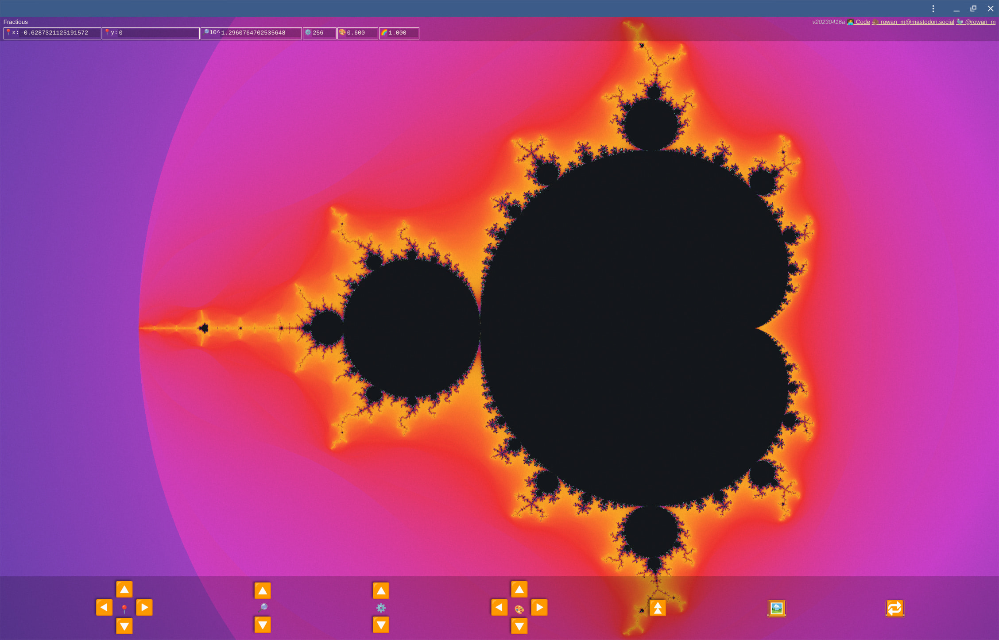

# Fractious

A deep-zooming viewer for the Mandelbrot set hosted at https://fractious-deep.web.app/.

The architecture combines :

- **Rust & WebAssembly** for calculating high-precision reference orbits on the CPU (using the `dashu` arbitrary-precision crate).
- **WebGPU** then renders via a `f32` fragment shader.
- **Web Workers** for offloading the heavy math from the UI thread.

Ping <https://bsky.app/profile/rowan.fyi> or <https://mastodon.social/@rowan_m> with questions.



## Run locally

Make sure you have `npm` and `cargo` installed.

On first run, install dependencies as per the lock file:

```
npm ci
```

The `build` command will build both the Wasm and web code.

```
npm run build
```

The `dev` command will start the local Vite dev server with hot reloading.

```
npm run dev
```

## Contributing

Before committing or submitting code, make sure you run the following commands to validate code quality.

Format the HTML, CSS, JavaScript, and Rust code using the `format` command.

```
npm run format
```

You can validate code is formatted correctly with the `format:check` command.

```
npm run format:check
```

Various linting and quality checking tools can be invoked via the `check` command.

```
npm run check
```

Unit tests for Wasm and JavaScript can be run with the `test` command.

```
npm run test
```

If you add new dependencies, make sure you run a full install and commit the lock file.

```
npm run i
git add package.json package-lock.json`
```
